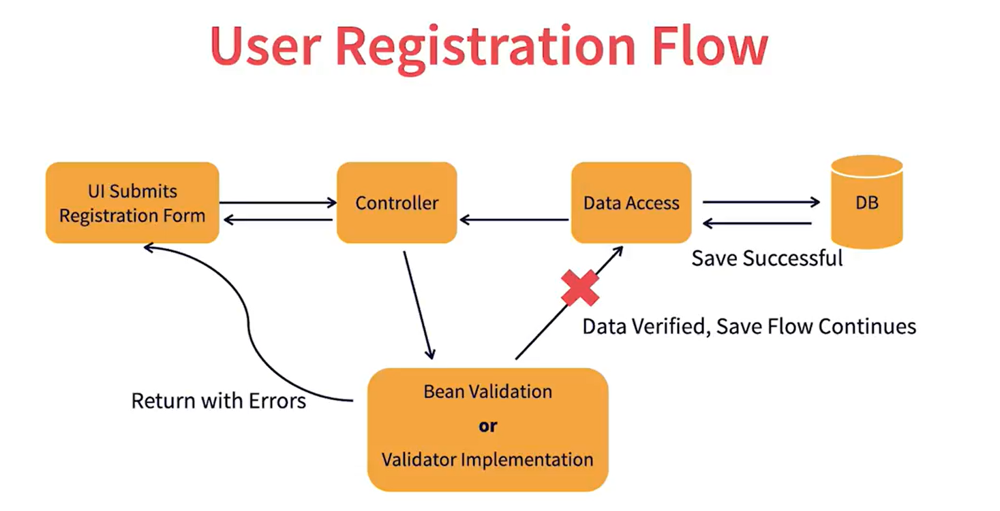

@@ -1 +1,115 @@
# Springwebmvc_codeandnotes
# Springwebmvc notes:

## Introduction to spring Framework
* Helps build enterprise application with ease and quickly
* Supports Groovy and Kotlin
* works with multiple scenarios
* ### Spring privides modular components
    * Core
    * Data and Transactions
    * Web
    * Messaging
* #### Open source
* #### Keeps evolving with time
* #### Solid Online support
## Spring 6 features
* Based on Java 17 and above
* Works with Jakarta EE 9+: Servlet 5.0+, JPA 3.0+
    * Works with jakarta packages instead of javax packages
* Supports lastes web servers: Tomcat, Jetty, Untertow
* Compatible with virtual threadds (java 19)
    * Web app - single thread per request
    * Configure Spring apps ti use virtual threads

## Overview Of Spring MVC

* Web-based framework built on Servlet API
* Follows MVC design Pattern
    * #### M: Model

      Holds the data of your application      

    * ##### V: View
      
        Displays data in the user interface of your application on the browser
      the view does not have knownlege of how the data was prepared

    * ####  C: Controller

      Controller sits between the view and model the job of the of the controller is to intercept any incoming request from the view, and perform the neccessary application logic.
* Separation of concerns


## Spring MVC flow

### M: Model

Data Object class

### V: view 

which is in the form of HTML file/ or java server page (jsp)

### C: Controller

Spring controller class

## Why Spring MVC?

* Works on Spring framework foundations
* Best for building modular web applications
* Flexible - not a lot of mandates
* Lets developers focus on business logic

## Project Development Overview 

* Build a Big Star Collectibles website
* All the static files provided css, js static pages
* add code for various flows in the app
* Add HTML paes as needed

  ## Project Development Flow
  Will folow MVC Patttern

  UI -----> Controller ----> Data access ----> DB

                        |
                        |
                 Service/Business


## Spring Boot to create MVC Application
* Traditional Development vs. Spring Boot
* provides auto-configuration for spring MVC
* Based on Spring Framework
* Embedded servlet container
* Generate Spring Boot project: at
spring Initializer website

## Overview of Thymelaf
* Server-side template engine
* Helps retain HTML template in your project development
* Can process HTML, XML, CSSS, JS and etc
* Modules Specifically for Spring framework

## Thymeleaf Capabilities
* Simple expressions
* Text operations
* Literals
* Arithmetic, boolean, comparison, equality, conditional

## Thymeleaf Standard Syntax
* variable expressions: ${...}
* Selection expressions: *{...}
* Link(URL) expressions: @{...}
* Fragment expressions: ~{...}


## Create the Homepage Flow
* Create a HomeController class in a package
* Add a method and return the index.html page
  example:
  public class HomeController {
   @GetMapping("/home")
  public String displayHome(){
  return "index";}
  // the above method will return index.html, asumming you have a file name index.html in your resources/template folder.
  }
* Add Thymeleaf to the index.html page
  adding Thymeleaf in index or any HTML page would like this:
  with the xmlns="http://www.w3.org/1999/xhtml"
      xmlns:th="http://www.thymeleaf.org" which is Thymeleaf namespace
 ## example 
```html
<html xmlns="http://www.w3.org/1999/xhtml "xmlns:th="http://www.thymeleaf.org">

  <head>
  
  </head>

  <body>
  
  
  </body>

</html>
```
## UI Fragments 
* Split HTML to use reusable components 
  * Header
  * Footer
  * Any other common components
* Refer components through fragments
  
#### UI Fragments in App
* Create a fragments.html file
* Move header, footer sections from index.html into fragments.html
* Add th: replace or th:insert on index.html to refer fragments

##### fragments reference: 
you would add a div tag then th:replace like this:
```html

<div th:replace="~{fragments.html :: header}"></div>
```

##### in fragments.html if you want to add a header component here is how it will look like:
```html <header th:fragment="header">
then the rest of the header code goes here 
</header>
```

## Template (`th:href`)
-  th:href="@{/getCharacter/{charname} (charname='Character-Detail-Delores')}"

- The `th:href` attribute is a Thymeleaf template that creates a URL.
- `@{/getCharacter/{charname} (charname='Character-Detail-Delores')}` generates the URL example: `/getCharacter/Character-Detail-Delores`.

## Controller
```java
@GetMapping("/getCharacter/{charname}")

public String getCharacter(@PathVariable("charname") String charname){

return "/characters/"+charname;

}
```
- The `@GetMapping` annotation maps the URL `/getCharacter/{charname}` to the `getCharacter` method.
- The method extracts the `charname` parameter from the URL.
- The method then returns a path `/characters/Character-Detail-Delores`.

## Controller Annotations and Objects

* @GetMapping, @PutMapping, @PostMapping, @DeleteMapping

those annotations are so you can mapp your url path with the controller methods
* @PathVariable

capture the path variable that you have in your incoming URL

* ResquestParam

Used to capture the request parameter that you have inside your controller methods
* Model

The Model API from the spring MVC framework helps you to store any data you want to navigate
into the UI

## Implement Search Use case  


### Steps in the code

- Create ProductController class and add a method for search function
- Create Product bean class
- Add ProductRepository class to talk to MySQL
which is the data access layer. repsitory APIs in spring data exist to incoporate all the boilerplate code that you have to write when you deal with a database
all the code is writen behind the scene so you don't have to write it.
ProductRepository is name like this because of the spring jpa naming convertion.
the Interface has to be annoted with @Repository and extends CrudRepository or JpaRepository.
the magic is that they give you a set of ready-made methods that you can quickly utilize to query the database.
to search product we can add in our method.


- Connect UI, Controller, and data acess classes

### Validations

- Why are validations needed
  - It important to verify the data before processing
  - Otherwise, we'll end up saving bad data
  - client vs server side
  - Cosmetic validations vs business validations
  #### Validation in Spring MVC
  - Bean validations
  - Validator contract
  #### bean validation
  -  Declaretive constraints on bean properties
  - Built-in constraints - @NotNull, @Min, @Max, so on
  - can develop custom constraints


### Data Binding
- Binding data to beans/domain objects/POJOs
## User Registration Flow



### Bean Validation
- Create UserController class and method to display user registration page
- Create a User bean and add constraints with error messages
- Add another method in controller class to submit the form
- Bind all properties on HTML
- Add error messages tags on HTML

### Validator Contract Implementation
- add a custom validator implementation
- Register custom validator

### Localization (L10n)/Internationalization (i18n)

* Adapting to local-specific needs
* Not just translation of text 
* Include multiple locales in the app
* in this we're going to focus on tranlation ontext for two language english, swedish/french

### How to Do L10n in spring
* Add resource bundle file in the app:
message_en.properties
* Add key-value entries in the file
* label.username=Username
* Configure the app to pick up the resource bundle

### How to Do i18n in Spring
- Add local-specific resource bundle
  - messages_sv.properties "sv" local code for Swedish language
  - message_fr.properties "fr" local code for french language
- Keys remain the same, values change
### L10n and i18n in the App
- Add messages_en.properties file
- Add LocaleConfiguaration class

### Save User Data

- Add UserRepository class to save user information
- Invoke UserRepository from UserController


